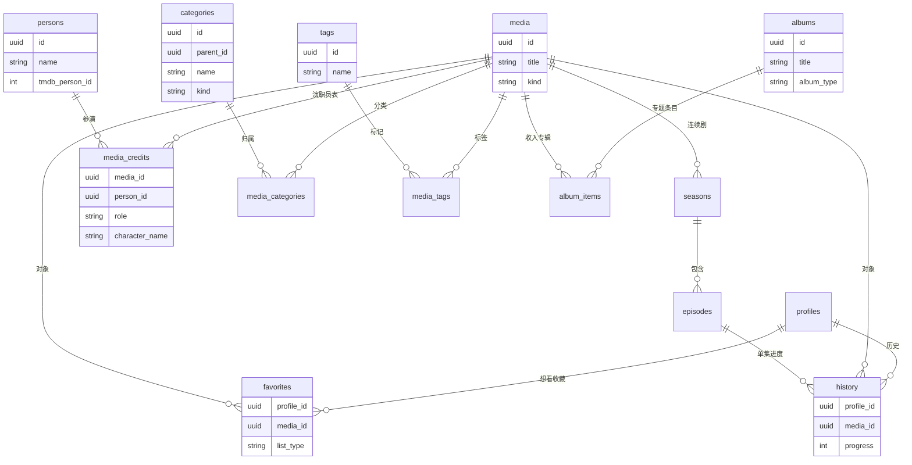

# MediaHub 媒资业务域模型

**文档版本**：v1.1  
**关联文档**：[MEDIA-SCHEMA.md](MEDIA-SCHEMA.md)（OTT 技术分层）· [OTT-GAPS.md](OTT-GAPS.md)（能力补全清单）  
**目标版本**：v0.5  

> 媒资不只是「一张 `media` 表」，而是围绕 **专辑、影人、标签、演职员、分类** 的内容目录，加上 **想看、收藏、历史** 等个人片库行为。  
> 本文定义**业务语言 ↔ 数据表**映射；物理文件、HLS 等见 [MEDIA-SCHEMA.md](MEDIA-SCHEMA.md)。

---

## 1. 域划分总览（六域）

完整 OTT 产品 = **内容目录 + 个人片库 + 媒体资产 + 体验呈现 + 合规分龄 + 本地化/轨道**。  
后三块缺口详见 **[OTT-GAPS.md](OTT-GAPS.md)**。

```
  A. 内容目录     作品 · 专辑 · 影人 · 演职员 · 分类 · 标签
  B. 个人片库     想看 · 收藏 · 历史 · 续播 · (用户片单)
  C. 媒体资产     源文件 · HLS 呈现          → MEDIA-SCHEMA

  D. 体验呈现     预告/花絮 · 下一集 · 跳过片头     ← OTT-GAPS P1–P2
  E. 合规分龄     内容分级 · 儿童 Profile 策略      ← OTT-GAPS P1
  F. 本地化/轨道  多语言元数据 · 海报变体 · 字幕/音轨 ← OTT-GAPS P1–P2
```

| 业务概念 | 英文/表名 | 说明 |
|----------|-----------|------|
| **作品** | `media` (work) | 一部电影或一部连续剧，Feed/详情的主键 |
| **专辑** | `albums` | **专题合集**（漫威、豆瓣片单），不是单部作品 |
| **季 / 集** | `seasons` / `episodes` | 连续剧结构 |
| **影人** | `persons` | 演员、导演、编剧等自然人 |
| **演职员** | `media_credits` | 作品 ↔ 影人 + 职务 + 角色名 |
| **分类** | `categories` | 类型树：电影/剧集/动漫 + 动作/悬疑… |
| **标签** | `tags` | 运营/扫描/用户打的自由标签 |
| **想看** | `favorites` (`want`) | 片单，未观看 |
| **收藏** | `favorites` (`liked`) | 喜欢，常显在「我的收藏」 |
| **在看 / 看过** | `favorites` + `history` | 在看=标记；看过=进度完成或手动标记 |
| **历史** | `history` | 续播、继续观看 |
| **预告/花絮** | `media_extras` | TMDB trailer、本地花絮（见 OTT-GAPS） |
| **字幕** | `subtitle_tracks` | 外挂/内嵌字幕轨（见 OTT-GAPS） |
| **内容分级** | `content_ratings` | MPAA/TV-MA/年龄，儿童过滤（见 OTT-GAPS） |
| **可播状态** | `availability_status` | available / missing / processing（见 OTT-GAPS） |

---

## 2. 概念关系图



---

## 3. A. 内容目录域

### 3.1 作品 `media`（核心条目）

对应豆瓣「条目」、TMDB Title、Jellyfin BaseItem。**对外 API 仍用 `media_id`。**

| 子概念 | 字段/条件 | 示例 |
|--------|-----------|------|
| 电影 | `kind=single`, `type=movie` | 《肖申克的救赎》 |
| 连续剧 | `kind=series`, `type=tvshow` | 《低智商犯罪》 |
| 动漫 | `kind=series`, `type=anime` | — |
| 纪录片 | `kind=single/series`, `type=documentary` | — |

**与「专辑」区别**：一部剧/一部电影 = **作品**；把多部作品捆在一起 = **专辑（专题）**。

### 3.2 专辑 `albums`（专题合集）

运营向容器，用于 CMS 片单、布局数据源、Manual Row。

| 字段 | 说明 |
|------|------|
| `title` | 《漫威电影宇宙》《周末悬疑精选》 |
| `album_type` | `collection`（人工）\| `franchise`（系列）\| `curated`（编辑精选） |
| `poster_url` / `overview` | 展示 |
| `sort_order` | 在 `album_items` 上 |

```
albums ──< album_items >── media
```

布局可新增数据源：`album` → 展开为作品列表 Feed。

### 3.3 影人 `persons`

| 字段 | 说明 |
|------|------|
| `name` / `original_name` | 显示名 |
| `tmdb_person_id` | UNIQUE，刮削锚点 |
| `profile_path` | 头像（TMDB path 或本地 URL） |
| `biography` / `birthday` / `place_of_birth` | 详情页 |
| `gender` / `known_for_department` | 筛选 |

详情页入口：**按影人浏览作品** → `GET /persons/:id/works`。

### 3.4 演职员 `media_credits`

作品与影人的 M:N，带职务。

| 字段 | 说明 |
|------|------|
| `media_id` | 作品 |
| `person_id` | 影人 |
| `role` | `actor` \| `director` \| `writer` \| `producer` \| `composer` … |
| `character_name` | 演员饰谁（可为空） |
| `billing_order` | 排序（主演靠前） |
| UNIQUE | `(media_id, person_id, role, character_name)` |

刮削：TMDB `credits` cast/crew → 批量 upsert。

### 3.5 分类 `categories`（树形）

替代 `media.genres` 文本数组，支持 **类型 + 自定义 CMS 分类**。

| 字段 | 说明 |
|------|------|
| `parent_id` | 父节点（NULL = 根） |
| `name` / `slug` | 动作、悬疑、电影、剧集… |
| `kind` | `genre`（TMDB 风格）\| `media_type` \| `custom` |
| `tmdb_genre_id` | 可选，同步 TMDB |

```
categories ──< media_categories >── media
```

Feed 过滤：`category:action` 走 join，不再 `ANY(genres)`。

**与标签区别**：

| | 分类 | 标签 |
|---|------|------|
| 结构 | 树形、互斥倾向 | 扁平、多选 |
| 来源 | TMDB genre、CMS | 扫描、运营、用户 |
| 用途 | 导航、筛选、儿童模式 | 专题、搜索、布局 `tag` 数据源 |

### 3.6 标签 `tags`

| 字段 | 说明 |
|------|------|
| `name` | UNIQUE，如 `4K`, `国语`, `DS920+测试` |
| `slug` | URL 友好 |
| `source_default` | 默认来源 |

```
tags ──< media_tags >── media
```

`media_tags.source`：`tmdb` \| `scanner` \| `manual` \| `user`  
迁移：现有 `media.tags[]` → 拆行写入 `tags` + `media_tags`。

---

## 4. B. 个人片库域（按 Profile）

Netflix「我的列表」类能力，**全部挂 `profile_id`**，与账号体系解耦（当前 localStorage Profile UUID）。

### 4.1 行为一览

| 用户说法 | 数据 | 典型 UI |
|----------|------|---------|
| **想看** | `favorites.list_type = want` | 我的片单 / 想看 |
| **收藏**（喜欢） | `favorites.list_type = liked` | 我的收藏 ❤️ |
| **在看** | `favorites.list_type = watching` 或 history 未完成 | 在看 |
| **看过** | `favorites.list_type = watched` 或 `history.completed` | 看过 |
| **历史** | `history` | 继续观看、续播 |
| **评分** | `favorites.rating` | 详情页打分 |

### 4.2 表设计演进

**现状**：`favorites` 一张表 + `favorite_type` 枚举 — 已覆盖想看/收藏/在看/看过。

**v0.5 优化**（可选，兼容迁移）：

```sql
-- 方案 A：保留 favorites，重命名列语义
ALTER TABLE favorites RENAME COLUMN favorite_type TO list_type;

-- 方案 B：拆表（更清晰，成本更高）
profile_watchlist   (profile_id, media_id)        -- 想看
profile_favorites   (profile_id, media_id)        -- 收藏/喜欢
profile_ratings       (profile_id, media_id, score)
-- history 不变
```

**推荐 v0.4**：方案 A，API 增加语义别名：

```
GET /library/want-to-watch   → favorites?list_type=want
GET /library/favorites       → favorites?list_type=liked
GET /library/watching        → favorites?list_type=watching
GET /library/watched         → favorites?list_type=watched
GET /library/history         → history + continue-watching
```

### 4.3 历史 `history`

| 字段 | 说明 |
|------|------|
| `media_id` | 作品 |
| `episode_id` | 剧集单集（电影 NULL） |
| `progress` / `duration` | 续播秒数 |
| `completed` | 是否看完 |
| `device` | web / android-tv |

**继续观看** = `history` 未完成 + 按 `updated_at` 排序（已有 API）。

---

## 5. 与现有代码映射

| 业务概念 | 当前实现 | 目标 |
|----------|----------|------|
| 作品 | `media` | 保留，补 `kind` |
| 专辑 | ❌ | `albums` + `album_items` |
| 影人 | ❌ | `persons` |
| 演职员 | ❌ | `media_credits` + TMDB 刮削 |
| 分类 | `media.genres[]` | `categories` + `media_categories` |
| 标签 | `media.tags[]` | `tags` + `media_tags` |
| 想看 | `favorites.want` | 保留 + `/library/want-to-watch` |
| 收藏 | `favorites.liked` | 保留 + `/library/favorites` |
| 历史 | `history` | 保留 |
| 源文件 | `media_files` | 见 MEDIA-SCHEMA |

---

## 6. API 规划（业务域）

### 6.1 目录

```
GET  /works                    # 作品列表（= /media）
GET  /works/:id                # 详情 + 演职员 + 分类 + 标签
GET  /works/:id/credits        # 演职员表
GET  /persons                  # 影人搜索
GET  /persons/:id              # 影人详情
GET  /persons/:id/works        # 参演作品
GET  /categories               # 分类树
GET  /categories/:slug/works   # 分类下作品
GET  /tags                     # 标签云
GET  /tags/:slug/works         # 标签下作品
GET  /albums                   # 专题专辑列表
GET  /albums/:id/works         # 专辑内作品
```

v0.5 前 **`/media` 别名保留**，新端点并行。

### 6.2 个人片库

```
GET    /library/want-to-watch
POST   /library/want-to-watch/:media_id
DELETE /library/want-to-watch/:media_id

GET    /library/favorites
POST   /library/favorites/:media_id      # toggle liked

GET    /library/history
GET    /library/continue-watching
POST   /history                          # 已有
GET    /resume/:media_id                 # 已有
```

---

## 7. 刮削与入库（业务视角）

```
TMDB Movie/TV Detail
    ├── Basic Metadata  → media（作品）
    ├── Genres          → categories + media_categories
    ├── Keywords        → tags + media_tags（可选）
    ├── Credits.cast    → persons + media_credits (role=actor)
    └── Credits.crew    → persons + media_credits (role=director/…)

本地扫描
    ├── 文件路径        → media_files（资产域）
    └── 文件名标签      → tags（如 2160p, H265）
```

---

## 8. Feed / 布局数据源扩展

| 数据源 type | 参数 | 解析为 |
|-------------|------|--------|
| `library` | genre, type | 作品列表 |
| `tag` | tag slug | 标签下作品 |
| `category` | category slug | 分类下作品 |
| `album` | album_id | 专辑内作品 |
| `person` | person_id | 影人作品（演员页） |
| `continue-watching` | — | history |
| `guess-you-like` | — | 推荐 |

---

## 9. 迁移路线图

| 阶段 | 内容 | 迁移 |
|------|------|------|
| **D1** | 影人 + 演职员 | `000010` 建表；刮削写入 credits | v0.5.0 |
| **D2** | 分类 / 标签规范化 | 从 `genres[]`/`tags[]` backfill | v0.5.0 |
| **D3** | 专题专辑 | `albums` + CMS 管理 + Feed | v0.5.x |
| **D4** | 片库 API 别名 | `/library/*` 路由 | v0.5.0 |
| **D5** | 影人详情页 | Web/TV UI | v0.5.x |

**不破坏**：`media_id`、`favorites`、`history` 主键与 FK 保持不变。

---

## 10. 命名约定（代码与 UI）

| UI 中文 | 代码实体 | 表名 | 避免混淆 |
|---------|----------|------|----------|
| 作品 / 条目 | `Work` / `Media` | `media` | — |
| 专题专辑 | `Album` | `albums` | ≠ 连续剧整部 |
| 连续剧 | `Series` | `media` kind=series | — |
| 影人 | `Person` | `persons` | ≠ user 账号 |
| 演职员 | `Credit` | `media_credits` | — |
| 分类 | `Category` | `categories` | ≠ layout |
| 标签 | `Tag` | `tags` | — |
| 想看 | `WantToWatch` | `favorites` want | — |
| 收藏 | `Favorite` | `favorites` liked | — |

---

## 11. OTT 补全索引

| 主题 | 文档 |
|------|------|
| 还缺什么、优先级 | [OTT-GAPS.md](OTT-GAPS.md) |
| 文件/HLS/Inventory | [MEDIA-SCHEMA.md](MEDIA-SCHEMA.md) |
| 版本排期 | [PRD-ROADMAP.md](PRD-ROADMAP.md) |

---

## 12. 变更记录

| 版本 | 日期 | 说明 |
|------|------|------|
| v1.1 | 2026-06-21 | 六域模型；链到 OTT-GAPS |
| v1.0 | 2026-06-21 | 初版：专辑/影人/标签/演职员/分类/片库域模型 |

---

*技术分层见 [MEDIA-SCHEMA.md](MEDIA-SCHEMA.md)；能力缺口见 [OTT-GAPS.md](OTT-GAPS.md)。*
