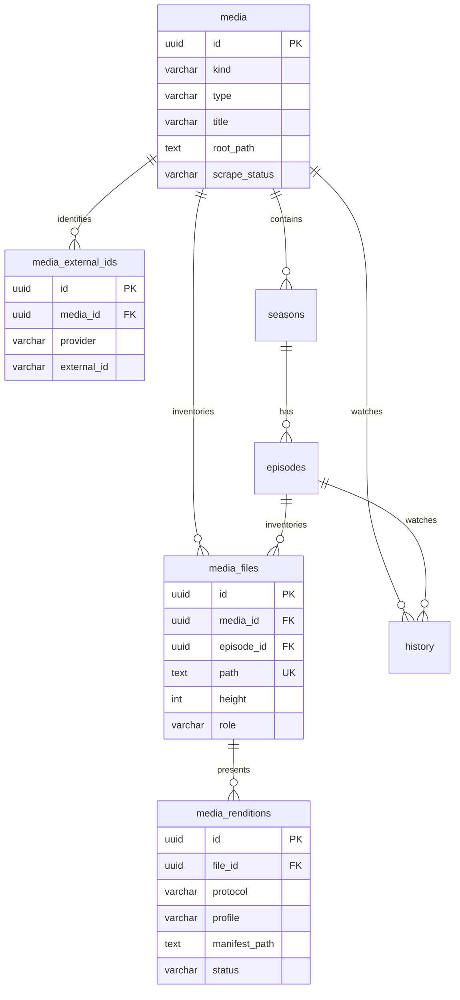

# MediaHub 媒资数据架构（OTT 对齐版）

**文档版本**：v2.1  
**业务域模型**：[MEDIA-DOMAIN.md](MEDIA-DOMAIN.md)（专辑 · 影人 · 标签 · 演职员 · 分类 · 片库）  
**关联迁移**：`000008`–`000010`  
**目标版本**：v0.4–v0.5  
**参考标准**：[MovieLabs Common Metadata](https://www.movielabs.com/md/md/) · [Media Manifest (MMC)](https://movielabs.com/md/manifest/) · EIDR 分层 · Jellyfin / Plex 实践  

> 本文档是媒资库的**唯一权威数据设计**。产品路线见 [PRD-ROADMAP.md](PRD-ROADMAP.md)。

---

## 1. OTT 行业怎么分层

> **业务实体**（专辑、影人、想看…）见 [MEDIA-DOMAIN.md](MEDIA-DOMAIN.md)。本节只讲 **Catalog 以下** 的技术分层（文件/HLS）。

商业 OTT（Prime Video、Disney+ 等）与自建 OTT（Jellyfin、Plex、Emby）在概念上高度一致：**浏览元数据**与**可播放资产**必须分离。

### 1.1 MovieLabs MDDF（推荐参照）

| 层级 | MovieLabs 概念 | 含义 | 与编码关系 |
|------|----------------|------|------------|
| **Basic Metadata** | Title / Work | 标题、简介、演员、分级 — **用户浏览的内容** | 无关 |
| **Structural** | Season / Episode | 连续剧结构 | 无关 |
| **Digital Asset** | Inventory 中的音视频文件 | 母版/成片文件（Mezzanine） | 有关 |
| **Presentation** | Experience / Manifest | 面向终端的打包呈现（HLS/DASH 多码率） | 有关 |

Prime Video 交付用的 **MMC Manifest** 典型结构：

```
MediaManifest
├── Experiences      ← 用户可消费的「呈现」（正片 / 预告）
├── Inventory        ← 实际交付的资产清单（视频/音轨/字幕文件）
└── ALIDExperienceMaps ← 商业可用性 ↔ 呈现 的映射
```

家庭 NAS 场景没有 ALID/Avails，但 **Inventory（有什么文件）** 与 **Experience（怎么播）** 的分离仍然适用。

### 1.2 EIDR 三层抽象（内容标识）

| EIDR Structural Type | 含义 | MediaHub 对应 |
|----------------------|------|-----------------|
| **Abstraction** | 抽象作品（如「低智商犯罪」这个 IP） | `media` 作品行 |
| **Performance** | 某一剪辑/语言剪辑版 | 未来 `media_editions`（可选） |
| **Digital** | 某一数字封装实例 | `media_files`（源文件）+ `media_renditions`（HLS 等） |

v0.4 先做到 **Abstraction + Digital**；多剪辑版（导演剪辑 vs 院线版）留 v0.6+。

### 1.3 自建 OTT 对照

| 概念 | Jellyfin | Plex | MediaHub v2 |
|------|----------|------|-------------|
| 浏览条目 | `BaseItem` (Movie/Series/Episode) | Metadata Item | `media` + `seasons` + `episodes` |
| 源文件/Part | `MediaSource` | Media Part | `media_files` |
| 转码流 | `TranscodingJob` / 动态 URL | 转码会话 | `media_renditions` + HLS 缓存 |
| 外部 ID | Provider IDs (Tmdb) | Agent IDs | `media_external_ids` |
| 播放进度 | UserData | View State | `history` |

MediaHub 的定位是 **单租户家庭 OTT**：一套 Catalog + 一套 Library，不做多租户 Avails。

---

## 2. MediaHub 目标模型（四层 OTT 映射）

```
┌──────────────────────────────────────────────────────────────────┐
│  L1  Catalog  目录层          media  (+ seasons / episodes)       │
│  Basic Metadata · TMDB 刮削 · Feed/布局/推荐 都指向这一层          │
└────────────────────────────┬─────────────────────────────────────┘
                             │
┌────────────────────────────▼─────────────────────────────────────┐
│  L2  Structure  结构层        seasons → episodes  (series only)   │
│  季/集元数据 · 集号 · 剧照 · 续播 episode_id                       │
└────────────────────────────┬─────────────────────────────────────┘
                             │
┌────────────────────────────▼─────────────────────────────────────┐
│  L3  Inventory  库存层        media_files                         │
│  母版文件 (Mezzanine) · ffprobe · 4K/1080p 多版本 · path UNIQUE    │
└────────────────────────────┬─────────────────────────────────────┘
                             │
┌────────────────────────────▼─────────────────────────────────────┐
│  L4  Presentation  呈现层     media_renditions  (v0.5)            │
│  HLS/DASH 切片 · 转码档位 · 缓存路径 · 与 stream API 对齐           │
└──────────────────────────────────────────────────────────────────┘

         media_external_ids  ──→  L1 与 TMDB/豆瓣/IMDB 等外部 Catalog 的映射
```

**设计原则（OTT 惯例）**：

1. **Catalog 不存文件路径**（仅 series 保留 `root_path` 作扫描锚点）  
2. **Inventory 是播放与 probe 的事实源**  
3. **Presentation 是转码/打包结果，可删可重建**（类似 CDN 边缘缓存）  
4. **Experience = 播放策略**：直连 → 流复制 HLS → 转码 HLS，而不是再建一张「体验表」

---

## 3. 概念 → 表 映射总览

| OTT 概念 | MediaHub 表 | 状态 | 说明 |
|----------|-------------|------|------|
| Title / Work + 演职员/分类/标签 | `media` + [业务域表](MEDIA-DOMAIN.md) | ✅ / 📋 | 作品 + 000010 |
| Season / Episode | `seasons`, `episodes` | ✅ 已有 | 标准连续剧结构 |
| External Catalog ID | `media.tmdb_id` | ✅ 已有 | v0.5 迁到 `media_external_ids` |
| Source Asset / Mezzanine | `media_files` | 🚧 000008 |  NAS 上的 mkv/mp4 |
| Rendition / Manifest | `media_renditions` | 📋 000009 | HLS playlist 缓存 |
| Play Session | — | — | 不落库，Redis 可选 |
| User Progress | `history` | ✅ 已有 | 标准 OTT Continue Watching |
| Scrape Pipeline | `scrape_logs` + `scrape_status` | ✅ 已有 | 类似 MAM 入库状态 |

---

## 4. ER 关系（OTT 视角）



---

## 5. 表结构详述

### 5.1 `media` — L1 Catalog（目录项）

OTT 中的 **Title / Series**，面向 Feed、搜索、详情页。

| 字段 | OTT 含义 | 说明 |
|------|----------|------|
| `id` | Content ID | 对外 `media_id`，全站 FK 锚点 |
| `type` | Content Type | `movie` \| `tvshow` \| `anime` \| `documentary` |
| `kind` | Structural | `single` \| `series` |
| `title` / `overview` / `poster_url` … | Basic Metadata | TMDB 刮削写入 |
| `storage_path` | **Library Anchor** | single：兼容=主文件；series：**扫描根目录**（非播放路径） |
| `scrape_status` | MAM 状态 | `pending` → `scraping` → `done` \| `failed` |
| `is_adult` | Content Rating | 儿童 Profile 过滤 |

**不再承载（v0.5 废弃）**：`file_size`, `video_codec`, `resolution` 等 — 属 Inventory 层。

### 5.2 `seasons` / `episodes` — L2 Structure

与 Netflix / Jellyfin 一致的标准层级：

```
Series (media kind=series)
  └── Season (season_number)
        └── Episode (episode_number) ← history.episode_id 指向这里
```

`episodes.file_path` 为 **兼容列**，= 该集 primary `media_files.path`。

### 5.3 `media_files` — L3 Inventory（源资产）

OTT **Inventory** 中的 Mezzanine / Source Package。

| 字段 | OTT 含义 | 说明 |
|------|----------|------|
| `path` | Asset URI | NAS 绝对路径，GLOBAL UNIQUE |
| `role` | Asset Role | `primary` \| `alternate` \| `extra`（v0.5 替代 bool `is_primary`） |
| `height` / `video_codec` | Asset Metadata | ffprobe |
| `probe_status` | QC 状态 | 下载未完成 / 损坏 = `failed` |
| `source` | Provenance | `scan` \| `download` \| `manual` |

**多版本（OTT 惯例）**：同一 Episode 可挂 `2160p` + `1080p` 两个 Inventory 项，`role=primary` 选默认，播放策略可「最高可用分辨率」。

### 5.4 `media_renditions` — L4 Presentation（呈现/打包）— v0.5

对应 MMC **Experience + packaged manifest**，存放 **可重建** 的转码输出：

| 字段 | 说明 |
|------|------|
| `file_id` | FK → `media_files`（对哪个源做呈现） |
| `protocol` | `hls` \| `dash`（当前仅 hls） |
| `profile` | `copy` \| `1080p` \| `720p` \| `480p` |
| `manifest_path` | 如 `/data/hls-cache/{id}/playlist.m3u8` |
| `status` | `building` \| `ready` \| `failed` |
| `expires_at` | LRU 淘汰（v1.0） |

当前 HLS 任务在内存 + 文件缓存；v0.5 将 `hlsTasks` **持久化到此表**，API 重启可恢复 — 对齐 OTT「Presentation 与 Source 分离」。

### 5.5 `media_external_ids` — 外部 Catalog 映射 — v0.5

OTT 通常对接多个 Metadata Provider：

| 字段 | 说明 |
|------|------|
| `media_id` | FK |
| `provider` | `tmdb` \| `douban` \| `imdb` \| `tvdb` |
| `external_id` | 提供商 ID |
| UNIQUE | `(provider, external_id)` |

迁移：`media.tmdb_id` / `douban_id` backfill 后，新刮削只写此表。

---

## 6. OTT 播放选型（Playback Policy）

与 PRD「直连 → 流复制 → 转码」一致，映射到四层：

```
用户点击播放 (Experience 请求)
    │
    ▼
解析 Inventory ──→ 取 primary media_file（或最高 height）
    │
    ├─ 浏览器可直连? ──→ Presentation=direct（不建 rendition）
    │
    ├─ MKV/HEVC ──→ Presentation=HLS copy（rendition profile=copy，原分辨率）
    │
    └─ 不兼容/弱网 ──→ Presentation=HLS transcode（rendition profile=720p/480p）
```

| 步骤 | OTT 术语 | MediaHub 实现 |
|------|----------|---------------|
| 选源 | Asset Selection | `PrimaryFile()` / 最高 `height` |
| 能力检测 | Client Capability | `GET /stream/probe` |
| 打包 | Packaging | FFmpeg HLS → `media_renditions` |
| 交付 | Delivery | `/stream/hls/:id/playlist.m3u8` |

---

## 7. 入库流水线（MAM → Catalog → Inventory）

对齐 OTT 内容入库（Ingest）标准流程：

```
┌─────────────┐    ┌──────────────┐    ┌─────────────┐    ┌──────────────┐
│ 1. Acquire  │───→│ 2. QC/Probe  │───→│ 3. Catalog  │───→│ 4. Publish   │
│ qBit/扫描   │    │ ffprobe      │    │ TMDB 刮削   │    │ Feed 失效    │
└─────────────┘    └──────────────┘    └─────────────┘    └──────────────┘
      │                    │                  │
      ▼                    ▼                  ▼
 media_files          probe_status=done    media.scrape_status=done
 source=download      height/codec        poster/genres
```

### 7.1 电影

```
文件落地 → QC(IsPlayable) → INSERT media (kind=single)
         → INSERT media_files (role=primary)
         → EnqueueScrape → TMDB 填充 Catalog
```

### 7.2 剧集

```
单集文件 → UPSERT media (kind=series, root_path=专辑目录)
        → UPSERT season/episode
        → UPSERT media_files (episode_id=…)
        → EnqueueScrape（专辑级，一次刮整剧 TMDB）
```

### 7.3 下载完成门槛（v0.4）

OTT 不做「半成品上架」— qBit `progress=100%` + `IsPlayable` 后才进入 Inventory。

---

## 8. 与 Feed / 布局 / 推荐的接口

OTT 首页 **Row/Shelf** 只引用 **Catalog ID**（`media.id`），不引用文件路径：

| 布局数据源 | 引用层 | 说明 |
|------------|--------|------|
| `media-list` | L1 Catalog | 人工选片 |
| `guess-you-like` | L1 Catalog | 推荐 ID 列表 |
| `continue-watching` | L1 + L2 | `history.media_id` + `episode_id` |
| Hero 背景 | L1 | `backdrop_url` |

播放 API 再向下解析 L3/L4 — **Feed 与 Inventory 解耦**，符合 OTT 最佳实践。

---

## 9. 迁移路线图

| 阶段 | OTT 能力 | 表/代码 | 版本 |
|------|----------|---------|------|
| **M1** | Inventory 分层 | `media_files`, `media.kind`, 000008 backfill | v0.4.0 |
| **M2** | 双写兼容 | ingest/scrape → `media_files` | v0.4.0 |
| **M3** | MAM 可见性 | CMS 刮削中心、QC 失败队列 | v0.4.x |
| **M4** | Catalog 去文件化 | 废弃 `media` 文件列 | v0.5.0 |
| **M5** | Presentation 持久化 | `media_renditions`，HLS 任务入库 | v0.5.0 |
| **M6** | 多 Provider ID | `media_external_ids` | v0.5.0 |
| **M7** | 多版本 / Edition | `role=alternate`，可选 `media_editions` | v0.6+ |

---

## 10. API 设计（OTT 风格）

### 10.1 现有（保持兼容）

| API | 层级 |
|-----|------|
| `GET /media` | L1 Catalog 列表 |
| `GET /media/:id` | L1 + L2 详情 |
| `GET /stream/direct` | L3 源文件交付 |
| `GET /stream/hls` | L4 呈现交付 |

### 10.2 新增（v0.5，RESTful OTT）

```
GET  /media/:id/assets              # L3 Inventory 列表（多版本）
GET  /media/:id/assets/:asset_id/renditions   # L4 可用呈现
POST /media/:id/assets/:asset_id/renditions  # 触发转码打包
GET  /media/:id/external-ids        # 外部 Catalog 映射
```

详情 JSON 可增加 OTT 常用字段：

```json
{
  "id": "...",
  "title": "低智商犯罪",
  "kind": "series",
  "primary_asset": { "height": 2160, "codec": "hevc", "label": "4K" },
  "seasons": [...]
}
```

---

## 11. 索引策略

```sql
-- Catalog
INDEX media(type, kind)
INDEX media(scrape_status) WHERE scrape_status != 'done'
GIN   media(title gin_trgm_ops)

-- Inventory
UNIQUE media_files(path)
INDEX media_files(media_id)
INDEX media_files(episode_id) WHERE episode_id IS NOT NULL
INDEX media_files(height DESC)  -- 多版本选最高

-- Presentation (v0.5)
UNIQUE media_renditions(file_id, protocol, profile)
INDEX media_renditions(status) WHERE status != 'ready'

-- External IDs (v0.5)
UNIQUE media_external_ids(provider, external_id)
```

---

## 12. 现状问题 → OTT 解法对照

| 现状问题 | 根因（违反 OTT 原则） | v2 解法 |
|----------|------------------------|---------|
| 剧集专辑行有空的 codec | Catalog 混入了 Inventory | codec 只在 `media_files` |
| 4K 被转 480p | Presentation 未区分 copy/transcode | L4 profile + 播放策略 |
| 路径语义混乱 | Catalog 存了两种 path | series 仅 `root_path`；播放走 L3 |
| 刮削 pending 堆积 | MAM 状态不可见 | `scrape_status` + 刮削中心 |
| HLS 重启丢失 | Presentation 未持久化 | `media_renditions` |

---

## 13. 变更记录

| 版本 | 日期 | 说明 |
|------|------|------|
| v2.0 | 2026-06-21 | OTT 对齐：MovieLabs/EIDR/Jellyfin 映射，四层模型，renditions/external_ids 规划 |
| v1.0 | 2026-06-21 | 初版三层模型 + 000008 |

---

## 14. 参考资料

- [MovieLabs Common Metadata v2.9](https://www.movielabs.com/md/md/v2.9/Common_Metadata_v2.9.pdf) — Basic vs Digital Asset  
- [MovieLabs Media Manifest (MMC)](https://movielabs.com/md/manifest/) — Inventory / Experience  
- [MovieLabs Ontology](https://mc.movielabs.com/docs/ontology/) — 制作与资产版本  
- [Jellyfin BaseItem / MediaSource](https://github.com/jellyfin/jellyfin) — 自建 OTT 参考实现  

---

*下一版：M5 落地时补充 `000009_media_renditions.up.sql` 与 Playback API 草案。*
