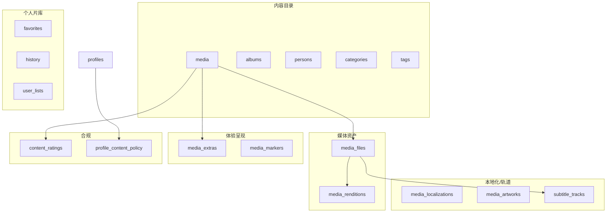

# MediaHub × OTT 业务补全清单

**文档版本**：v1.0  
**关联**：[MEDIA-DOMAIN.md](MEDIA-DOMAIN.md) · [MEDIA-SCHEMA.md](MEDIA-SCHEMA.md) · [PRD-ROADMAP.md](PRD-ROADMAP.md)  

> 在「专辑、影人、片库」之外，对照商业 OTT 与 Jellyfin/Plex 实践，列出 **仍缺或仅半成品** 的能力，并给出优先级与表设计方向。

---

## 1. 能力全景（六域模型）

在原有 A/B/C 三域上，OTT 完整产品通常还有 **D/E/F** 三块：

```
A. 内容目录   作品 · 专辑 · 影人 · 分类 · 标签          ← MEDIA-DOMAIN 已覆盖
B. 个人片库   想看 · 收藏 · 历史 · 续播                  ← 已有，API 待别名
C. 媒体资产   源文件 · HLS 呈现 · 多码率               ← MEDIA-SCHEMA 已规划

D. 体验呈现   预告 · 花絮 · 下一集 · 跳过片头 · 章节     ← ⚠️ 大缺口
E. 合规分龄   内容分级 · 儿童过滤 · Profile 上限        ← ⚠️ 仅 is_adult
F. 本地化     多语言标题/简介 · 海报变体 · 音轨/字幕      ← ⚠️ 大缺口

G. 发现检索   搜索 · 筛选 Facet · 相似/系列关联         ← 部分有
H. 运营状态   可播/缺文件/刮削中 · 入库 QC · 统计       ← 部分有
```

---

## 2. 缺口矩阵

图例：✅ 已有 · 🚧 部分 · ❌ 缺失 · 📋 已规划文档

| OTT 能力 | 行业参考 | MediaHub 现状 | 建议表/模块 | 优先级 |
|----------|----------|---------------|-------------|--------|
| **作品/季/集** | Title Hierarchy | ✅ `media/seasons/episodes` | — | — |
| **专题专辑** | Collection | 📋 `albums` | 000010 | P1 |
| **影人/演职员** | Credits | 📋 `persons/credits` | 000010 + 刮削 | P1 |
| **分类/标签** | Genre/Keyword | 🚧 `genres[]`/`tags[]` | `categories/tags` | P1 |
| **想看/收藏/历史** | My List | ✅ `favorites/history` | `/library/*` API | P1 |
| **源文件/Inventory** | MediaSource | 🚧 `media_files` | 000008 | P0 |
| **HLS 呈现** | Manifest | 🚧 内存任务 | `media_renditions` | P0 |
| **外部 ID** | Provider IDs | 🚧 列字段 | `media_external_ids` | P2 |
| **多版本/剪辑版** | Edition/Performance | ❌ | `media_editions` | P3 |
| **内容分级** | MPAA/TV-MA/年龄 | 🚧 `is_adult` | `content_ratings` | **P1** |
| **儿童 Profile 规则** | Parental Controls | 🚧 `is_kid`+过滤 | `profile_content_policy` | **P1** |
| **本地化元数据** | LocalizedInfo | ❌ 仅 TMDB zh-CN | `media_localizations` | P2 |
| **海报/背景变体** | Artwork Purpose | 🚧 单 URL 列 | `media_artworks` | P2 |
| **预告片/花絮** | Trailer/Extra | ❌ | `media_extras` | **P2** |
| **字幕轨道** | Timed Text | 🚧 SubHD API，无表 | `subtitle_tracks` | **P1** |
| **音轨/语言版** | Audio Track | ❌ | `audio_tracks` | P2 |
| **内嵌字幕标记** | — | 🚧 file 层 bool | 随 probe | P1 |
| **跳过片头/片尾** | Skip Intro | ❌ | `media_markers` | P3 |
| **章节** | Chapters | ❌ | `media_chapters` 或 ffprobe | P3 |
| **自动下一集** | Binge | ❌ UI+规则 | 业务层 | **P1** |
| **相似/同系列** | Related | 🚧 recommend API | `media_relations` | P2 |
| **可播状态** | Availability | 🚧 scrape_status | `availability_status` | **P1** |
| **文件缺失检测** | — | ❌ | file probe + 定时 | P1 |
| **全文搜索** | Search | 🚧 title ILIKE | 搜索索引/FTS | P2 |
| **用户自建片单** | Custom List | ❌ | `user_lists` | P3 |
| **Profile 播放偏好** | Settings | ❌ | `profile_playback_prefs` | P2 |
| **Feed 曝光统计** | Analytics | ❌ PRD v0.6 | 匿名事件 | P3 |
| **播放队列** | Up Next Queue | ❌ | 客户端/Redis | P3 |
| **设备/并发** | Stream limit | ❌ 家庭不需要 | — | 不做 |
| **Avails/窗口期** | 上下架时间 | ❌ 家庭全库常开 | `published_at` 可选 | P3 |

---

## 3. 重点补充详述

### 3.1 D 域 — 体验呈现（用户最能感知）

#### 预告片 / 花絮 `media_extras`

OTT 详情页标配：正片按钮上方播预告。

| 字段 | 说明 |
|------|------|
| `media_id` | 所属作品 |
| `extra_type` | `trailer` \| `teaser` \| `behind_the_scenes` \| `clip` |
| `title` | 展示名 |
| `source` | `tmdb` \| `local_file` \| `url` |
| `file_path` / `external_url` | 本地或 YouTube/TMDB video |
| `duration_sec` | 可选 |

TMDB `videos` API → 刮削时写入；本地 `Trailers/` 目录可扫描入库。

#### 自动下一集

| 规则 | 说明 |
|------|------|
| 剧集播放 `completed` 或进度 >90% | 提示/自动播放 `episode_number+1` |
| 数据 | `seasons/episodes` 已有集号，无需新表 |
| API | `GET /works/:id/next-episode?after_episode_id=` |

#### 跳过片头 / 章节 `media_markers`（v0.6+）

Netflix 级体验，可来自：

- 社区数据库（IntroDB 类）  
- ffprobe chapters  
- CMS 手工标注  

```sql
media_markers (media_id, episode_id?, marker_type, start_sec, end_sec)
-- marker_type: intro | credits | recap
```

---

### 3.2 E 域 — 合规与分龄

现状：仅 `media.is_adult` + Profile `is_kid` + Feed `ExcludeAdult`。

OTT 需要：

#### 内容分级 `content_ratings`

| 字段 | 说明 |
|------|------|
| `media_id` | 作品 |
| `country` | `CN` \| `US` … |
| `system` | `tmdb` \| `mpaa` \| `tv-ma` |
| `rating` | `PG-13` / `15+` / `TV-MA` |
| `advisories` | text[] 暴力/语言… |

TMDB `release_dates` / `content_ratings` 刮削写入。

#### Profile 内容策略 `profile_content_policy`

| 字段 | 说明 |
|------|------|
| `profile_id` | |
| `max_rating_level` | 数值或枚举，儿童=低 |
| `block_adult` | bool |
| `allowed_category_ids` | 可选白名单 |

Feed / 搜索 / 推荐统一走 **同一过滤函数**（避免 CMS 与 Player 不一致）。

---

### 3.3 F 域 — 本地化与轨道

#### 本地化元数据 `media_localizations`

TMDB `translations` → 多语言标题/简介。

| 字段 | 说明 |
|------|------|
| `media_id` | |
| `locale` | `zh-CN`, `en-US` |
| `title` / `overview` | |
| UNIQUE | `(media_id, locale)` |

Profile 或 `Accept-Language` 决定展示哪条；缺省回退 `media.title`。

#### 海报变体 `media_artworks`

MovieLabs **Artwork Purpose**（poster, backdrop, logo, still）。

| 字段 | 说明 |
|------|------|
| `media_id` / `season_id` / `episode_id` | 可挂不同层级 |
| `art_type` | `poster` \| `backdrop` \| `logo` \| `still` |
| `locale` | 可选 |
| `url` / `local_path` | |
| `width` / `height` | |

替代单一 `poster_url` 列，支持 TV 详情 Hero 与 Web 卡片不同图。

#### 字幕轨道 `subtitle_tracks`

| 字段 | 说明 |
|------|------|
| `file_id` | FK `media_files` 或 `episode_id` |
| `language` | `zh`, `en` |
| `format` | `srt` \| `ass` \| `vtt` \| `embedded` |
| `path` | 外挂路径 |
| `source` | `embedded` \| `subhd` \| `manual` |
| `is_default` | Profile 偏好匹配 |

已有 SubHD Service → 下载后写入此表；Player 读列表切换。

#### 音轨 `audio_tracks`（多语言版）

同一文件多音轨仅 probe 即可；**多文件不同语言**（国配/原声各一份 mkv）→ 多个 `media_files` + `language` 字段 + `role=alternate`。

---

### 3.4 G 域 — 发现与关联

#### 作品关系 `media_relations`

| relation_type | 示例 |
|---------------|------|
| `sequel` | 续集 |
| `prequel` | 前传 |
| `same_franchise` | 同宇宙 |
| `remake` | 翻拍 |
| `similar` | 运营手工关联 |

TMDB 部分可自动；详情页「相关推荐」除算法外可展示 **系列顺序**。

#### 搜索增强

| 阶段 | 方案 |
|------|------|
| v0.5 | 作品 title + 影人 name 联合搜索 |
| v0.6 | Postgres FTS 或 Meilisearch：`works + persons + tags` |

---

### 3.5 H 域 — 运营与可播状态

OTT 后台必须回答：**这部现在能不能播？**

#### 可播状态 `availability_status`（作品级聚合）

| 状态 | 含义 |
|------|------|
| `available` | 至少一个 primary 文件可播 |
| `processing` | 下载中 / 刮削中 / 转码中 |
| `missing` | 库里有元数据，文件丢失 |
| `unreleased` | 仅有 TMDB，未入库（库外推荐） |

```sql
-- 可冗余在 media 上，或由 view 计算
media.availability_status VARCHAR(20)
media.available_at TIMESTAMP  -- 首次可播时间，用于「最近上架」
```

CMS **刮削中心** 与 **仪表盘** 按此筛选，比只看 `scrape_status` 更贴近运营。

#### 入库 QC 事件

| 事件 | 触发 |
|------|------|
| `file.probe_failed` | 损坏/未完成下载 |
| `scrape.failed` | TMDB 无匹配 |
| `rendition.failed` | HLS 失败 |

可写入现有 `scrape_logs` 或扩展为 `library_events` 审计流。

---

## 4. 与 MovieLabs 的对照补全

| MovieLabs 包 | MediaHub 对应 | 状态 |
|--------------|---------------|------|
| Basic Metadata | `media` + localizations | 部分 |
| Digital Asset Metadata | `media_files` + tracks | 部分 |
| Container Metadata | `container` on file | 🚧 |
| Content Ratings | `content_ratings` | ❌ |
| Artwork | `media_artworks` | ❌ |
| Manifest / Experience | `media_renditions` + stream API | 🚧 |
| People | `persons` + `media_credits` | 📋 |

---

## 5. 推荐实施顺序（叠加 PRD）

### v0.4（与体验闭环并行）

| # | 项 | 域 |
|---|-----|-----|
| 1 | `media_files` + 4K 播放 | C |
| 2 | `availability_status` 计算（有文件=available） | H |
| 3 | 文件 QC / probe_failed | H |

### v0.5（OTT 产品化）

| # | 项 | 域 |
|---|-----|-----|
| 4 | 影人/演职员/分类/标签/专辑 | A |
| 5 | `subtitle_tracks` + Player 切换 | F |
| 6 | `content_ratings` + 儿童 Profile 策略 | E |
| 7 | `/library/*` + 下一集 API | B + D |
| 8 | `media_renditions` 持久化 | C |
| 9 | `media_extras`（TMDB 预告） | D |
| 10 | 搜索：作品 + 影人 | G |

### v0.6

| # | 项 | 域 |
|---|-----|-----|
| 11 | `media_localizations` + `media_artworks` | F |
| 12 | `media_relations` | G |
| 13 | `user_lists` 用户自建片单 | B |
| 14 | Feed 曝光统计 | H |

### v1.0 / 可选

| # | 项 |
|---|-----|
| 15 | `media_markers` 跳过片头 |
| 16 | `media_editions` 导演剪辑 |
| 17 | `profile_playback_prefs` |

---

## 6. 建议新增迁移（规划 `000011`）

```sql
-- 内容分级
content_ratings (media_id, country, system, rating, advisories)

-- 字幕
subtitle_tracks (id, media_file_id, language, format, path, source, is_default)

-- 预告/花絮
media_extras (id, media_id, extra_type, title, source, file_path, external_url)

-- 海报变体（可先只 backfill poster/backdrop）
media_artworks (id, media_id, art_type, locale, url, width, height)

-- 作品关系
media_relations (from_media_id, to_media_id, relation_type)

-- 作品可播状态（冗余字段，定时 job 刷新）
ALTER TABLE media ADD COLUMN availability_status VARCHAR(20) DEFAULT 'processing';
ALTER TABLE media ADD COLUMN available_at TIMESTAMP;

-- Profile 分龄策略
profile_content_policy (profile_id, max_rating_level, block_adult)
```

**不一次全建**：按 v0.5 Sprint 拆成 `000011a`/`000011b`。

---

## 7. API 补全（OTT 惯例）

```
# 体验
GET  /works/:id/extras?type=trailer
GET  /works/:id/next-episode?after_episode_id=
GET  /works/:id/related

# 轨道
GET  /works/:id/subtitles?episode_id=
GET  /works/:id/audio-tracks?episode_id=

# 合规
GET  /works/:id/ratings

# 状态
GET  /works/:id/availability

# 搜索
GET  /search?q=&type=all|work|person
```

---

## 8. 六域 ER（目标态）



---

## 9. 明确仍不做（家庭 OTT）

| 能力 | 原因 |
|------|------|
| 多租户 / 租户隔离 | 单家庭 |
| Avails / 地理版权窗口 | 无版权商务 |
| 并发流限制 / DRM | 内网信任 |
| 广告 / 会员等级 | 无商业化 |
| CDN 边缘节点 | NAS 直连 |

---

## 10. 变更记录

| 版本 | 日期 | 说明 |
|------|------|------|
| v1.0 | 2026-06-21 | 初版：六域缺口矩阵 + v0.5/v0.6 实施序 |

---

*实施时同步更新 [MEDIA-DOMAIN.md](MEDIA-DOMAIN.md)、[MEDIA-SCHEMA.md](MEDIA-SCHEMA.md)、[PRD-ROADMAP.md](PRD-ROADMAP.md)。*
